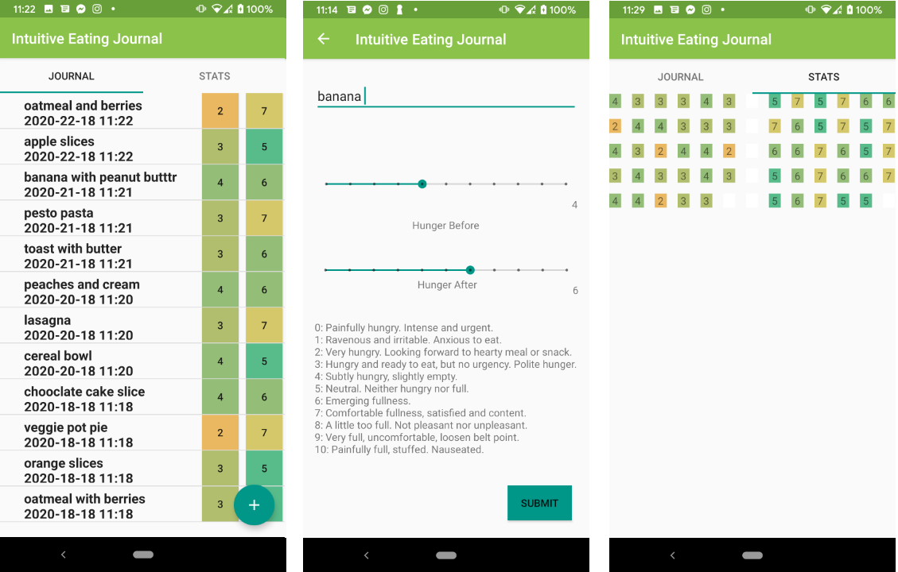

#  Intuitive Eating Journal App

This is an Android phone app to help log your intuitive eating recovery. I couldn't find any apps that supported this type of journaling, so here's my first attempt with some bare-bones features! I hope this helps someone also looking for an app with similar functionality :)

## About Intuitive Eating

*Excerpts were taken from this [article](https://www.nationaleatingdisorders.org/blog/what-does-intuitive-eating-mean) on the National Eating Disorders website. To find out more about intuitive eating, check out the [official website](https://www.intuitiveeating.org/).*

Intuitive eating is about trusting your inner body wisdom to make choices around food that feel good in your body, without judgment and without influence from diet culture. We are all born with the skill to eat, to stop when we are full, to eat when we are hungry and to eat satisfying foods. 

Diet culture breaks this trust, establishing rules around food because they are all, in some way, focused on the thin ideal; that any body other than a thin one, is wrong.  Those food rules lead to an emotional value placed on food, and when we put that emotional value on food, we then internalize it as we eat and that leads to thoughts like, "I’m so bad because I ate X.". Food is not good or bad and labeling it as such can pose many problems. Nutritionally, just like bodies, all foods are different. Emotionally though, all foods must be equal. One food does not make you bad while the other makes you good. If we can approach ALL FOODS as emotionally equal, we can truly begin to connect with our own inner wisdom. 

Intuitive eating is a peace movement. It’s ending the war with your body, making peace with food and giving up the needless war against our body and how we eat. It can be a beautiful part of eating disorder recovery, helping cultivate attunement to the physical sensations that arise from within your body in a way that honors both your emotional and physical well-being.